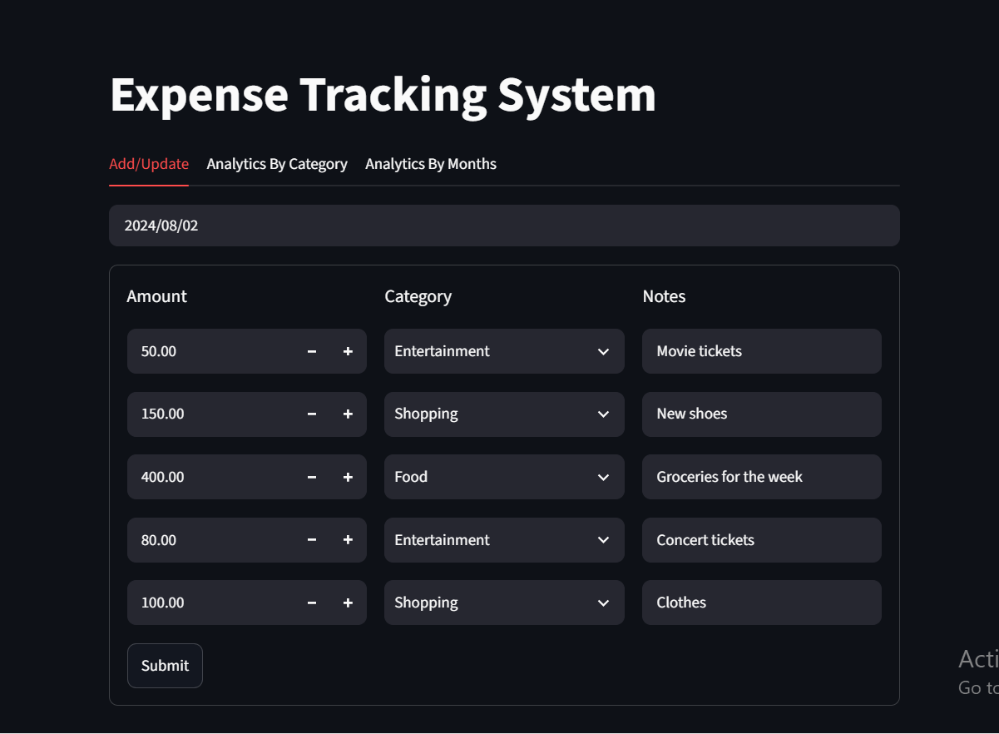

# Expense Management System
A full stack expense management application built with Python, FastAPI, Streamlit, MySQL, and Pytest.

The application allows users to record and manage expenses, organize expenses by category, and analyze spending patterns through category based and monthly analytics.

## Features
- Add new expenses
- Update existing expenses
- View expenses for a selected date
- Delete expenses for a selected date
- Analyze expenses by category
- Analyze monthly expenses
- Interactive Streamlit user interface
- FastAPI backend
- MySQL database integration
- Automated testing with Pytest
- Backend logging

## Tech Stack
- **Frontend:** Streamlit
- **Backend:** FastAPI
- **Database:** MySQL
- **Data Analysis:** Pandas
- **Data Visualization:** Streamlit
- **API Communication:** Requests
- **Testing:** Pytest

## Project Structure
- **frontend/**: Contains the Streamlit application code.
- **backend/**: Contains the FastAPI backend server code.
- **tests/**: Contains the test cases for both frontend and backend.
- **requirements.txt/**: Lists the required Python packages.
- **README.md/**: Provides an overview and instructions for the project.


## Setup Instructions
1. **Clone the repository**: 
    ```bash
    git clone https://github.com/barira1993/expense-management
    cd expense-management-system
    ```

2. **Install dependencies**:
    ```commandline
    pip install -r requirements.txt
    ```

3. **Run the FastAPI server**:
    ```commandline
    uvicorn server.server:app --reload
    ```

4. **Run the Streamlit app**:
    ```commanline
    streamlit run frontend/app.py
    ```


## Application Screenshots

### Add / Update Expenses
Users can add new expenses and update existing expense records through the Streamlit interface.


### Expense Analytics By Category
The category analytics section provides a breakdown of expenses by category, helping users understand where their money is being spent.


### Monthly Expense Analytics
The monthly analytics section provides a summary of total expenses for each month.


## Author
**Barira Abrejo**

This project was developed as part of my Data Science learning journey.

GitHub: https://github.com/barira1993

LinkedIn: https://www.linkedin.com/in/barira-abrejo/
